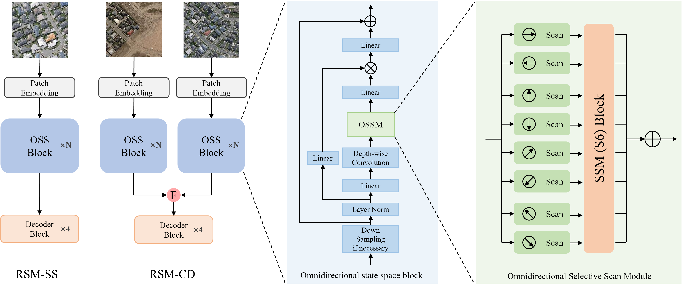

<div align="center">
    <h2>
        RS-Mamba for Large Remote Sensing Image Dense Prediction
    </h2>
</div>
<br>

<div align="center">
  
</div>
<br>
<div align="center">
  <!-- <a href="https://kychen.me/RSMamba">
    <span style="font-size: 20px; ">项目主页</span>
  </a>
       -->
  <a href="http://arxiv.org/abs/2404.02668">
    <span style="font-size: 20px; ">arXiv</span>
  </a>
      
  <a href="resources/RS-Mamba.pdf">
    <span style="font-size: 20px; ">PDF</span>
  </a>
  <!--     
  <a href="https://huggingface.co/spaces/KyanChen/RSMamba">
    <span style="font-size: 20px; ">HFSpace</span>
  </a> -->
</div>
<br>
<br>

[](https://github.com/walking-shadow/Official_Remote_Sensing_Mamba)
[](LICENSE)
[](http://arxiv.org/abs/2404.02668)

<!-- [](https://huggingface.co/spaces/KyanChen/RSMamba) -->

<!-- <br>
<br> -->

<div align="center">

English | [简体中文](README_Chinese.md)

</div>

## Introduction

The repository for this project is the code implementation of the paper [RS-Mamba for Large Remote Sensing Image Dense Prediction](http://arxiv.org/abs/2404.02668), developed based on the environment of the [VMamba](https://github.com/MzeroMiko/VMamba).

If you find this project helpful, please give us a star ⭐️.

<details open>
<summary>Main Contribution</summary>

- For the first time, the state space model (SSM) is introduced to dense prediction tasks in remote sensing, where our Recurrent State Space Model (RSM) maintains a global effective receptive field with linear complexity.
·
- Reflecting the spatial feature distribution across multiple directions in remote sensing images, RSM employs selective scanning over multiple directions.
·
- Experiments on semantic segmentation and change detection tasks has demonstrated that RSM can achieve state-of-the-art (SOTA) performance even with the simplest model architecture and training methodologies.

</details>

## Updates

🌟 **2024.03.29** Released the RS-Mamba project

🌟 **2024.03.29** Released the code of models and training framwork

## TODO

- [X] Open source the model code
- [X] Open source the training code

## Table of Contents

- [Introduction](#introduction)
- [Updates](#updates)
- [TODO](#todo)
- [Table of Contents](#table-of-contents)
- [Description of Folders and Files](#description-of-folders-and-files)
- [Installation](#installation)
  - [Environment Setting](#environment-setting)
- [Dataset Preparation](#dataset-preparation)
  - [Remote Sensing Semantic Segmentation Dataset](#remote-sensing-semantic-segmentation-dataset)
    - [Massachusetts Roads Dataset](#massachusetts-roads-dataset)
    - [WHU Dataset](#whu-dataset)
    - [Organization](#organization)
  - [Remote Sensing Change Detection Dataset](#remote-sensing-change-detection-dataset)
    - [WHU-CD Dataset](#whu-cd-dataset)
    - [LEIVR-CD Dataset](#leivr-cd-dataset)
    - [Organization](#organization-1)
- [Model Training and Inference](#model-training-and-inference)
  - [Training and Inference of Semantic Segmentation Model](#training-and-inference-of-semantic-segmentation-model)
  - [Training and Inference of Change Detection Model](#training-and-inference-of-change-detection-model)
- [FAQ](#faq)
  - [1. Problems when installing selective\_scan package in Vmamba](#1-problems-when-installing-selective_scan-package-in-vmamba)
  - [2. ModuleNotFoundError: No module named 'selective\_scan\_cuda' when running the code](#2-modulenotfounderror-no-module-named-selective_scan_cuda-when-running-the-code)
- [Citation](#citation)
- [License](#license)

## Description of Folders and Files
The folders `semantci_segmentation_mamba` and `change_detection_mamba` respectively contain the code for remote sensing semantic segmentation and change detection tasks, organized in a similar manner.

Taking the change_detection_mamba folder as an example, `train.py` and `inference.py` are the training and inference scripts respectively, `rs_mamba_cd.py` contains the model code, and the `utils` folder stores various other code files.

Within the `utils` folder, `data_loading.py` is the code file for data loading, `dataset_process.py` is the dataset processing file containing various functions for preprocessing change detection datasets, `losses.py` contains the code for loss functions, `path_hyperparameter.py` stores various model and training hyperparameters, dataset names, and model hyperparameters are also set therein, and `utils.py` includes code for training and validation.

<!-- - [致谢](#致谢) -->

<!-- - [联系我们](#联系我们) -->

## Installation

### Environment Setting

<details open>

**Step 1**: Follow the installation instructions of the [VMamba project](https://github.com/MzeroMiko/VMamba) to install the "rs_mamba" environment.

**Step 2**: Run the following command to install dependencies.

If you only use the model code, this step is not needed.

```shell
pip install -r requirements.txt
```

## Dataset Preparation

<details open>

### Remote Sensing Semantic Segmentation Dataset

#### Massachusetts Roads Dataset

- Dataset Download: [Massachusetts Roads Dataset](https://www.cs.toronto.edu/~vmnih/data/)。

#### WHU Dataset

- Dataset Download: [WHU Dataset](http://gpcv.whu.edu.cn/data/building_dataset.html)。

#### Organization

You need to organize the data set into the following format:

```
${DATASET_ROOT} # dataset root dir
├── train
    ├── image
        └── 0001.tif
        └── 0002.tif
        └── ...
    ├── label
        └── 0001.tif
        └── 0002.tif
        └── ...
├── val
    ├── image
        └──0001.tif
        └── 0002.tif
        └── ...
    ├── label
        ├── 0001.tif
        └── 0002.tif
        └── ...
├── test
    ├── image
        └── 0001.tif
        └── 0002.tif
        └── ...
    ├── label
        └── 0001.tif
        └── 0002.tif
        └── ...
```

### Remote Sensing Change Detection Dataset

#### WHU-CD Dataset

- Dataset Download: [WHU-CD Dataset](http://gpcv.whu.edu.cn/data/building_dataset.html)。

#### LEIVR-CD Dataset

- Dataset Download: [LEVIR-CD Dataset](https://chenhao.in/LEVIR/)。

#### Organization

You need to organize the data set into the following format:

```
${DATASET_ROOT} # dataset root dir
├── train
    ├── t1
        └── 0001.tif
        └── 0002.tif
        └── ...
    ├── t2
        └── 0001.tif
        └── 0002.tif
        └── ...
    ├── label
        └── 0001.tif
        └── 0002.tif
        └── ...
├── val
    ├── t1
        └── 0001.tif
        └── 0002.tif
        └── ...
    ├── t2
        └── 0001.tif
        └── 0002.tif
        └── ...
    ├── label
        ├── 0001.tif
        └── 0002.tif
        └── ...
├── test
    ├── t1
        └── 0001.tif
        └── 0002.tif
        └── ...
    ├── t2
        └── 0001.tif
        └── 0002.tif
        └── ...
    ├── label
        └── 0001.tif
        └── 0002.tif
        └── ...
```

## Model Training and Inference

All hyperparameters for model training and inference are located in the `utils/path_hyperparameter.py` file, with corresponding comments for explanation.

### Training and Inference of Semantic Segmentation Model

Firstly, navigate to the semantic segmentation folder by running the following command in the command line:

```
cd semantic_segmentation_mamba
```

To start training, run the following code in the command line:

```
python train.py
```

If you want to debug during training, run the following command in the command line:

```
python -m ipdb train.py
```

To perform testing or inference in the command line, run the following code:

```
python inference.py
```

### Training and Inference of Change Detection Model

Firstly, navigate to the change detection folder by running the following command in the command line:

```
cd change_detection_mamba
```

To start training, run the following code in the command line:

```
python train.py
```

If you want to debug during training, run the following command in the command line:

```
python -m ipdb train.py
```

To perform testing or inference in the command line, run the following code:

```
python inference.py
```

<!-- ## 模型训练

### RSMamba 模型

#### Config 文件及主要参数解析

我们提供了论文中不同参数大小的 RSMamba 模型的配置文件，你可以在 [配置文件](configs/rsmamba) 文件夹中找到它们。Config 文件完全与 MMPretrain 保持一致的 API 接口及使用方法。下面我们提供了一些主要参数的解析。如果你想了解更多参数的含义，可以参考 [MMPretrain 文档](https://mmpretrain.readthedocs.io/zh-cn/latest/user_guides/config.html)。

<details>

**参数解析**：

- `work_dir`：模型训练的输出路径，一般不需要修改。
- `code_root`：代码根目录，**修改为本项目根目录的绝对路径**。
- `data_root`：数据集根目录，**修改为数据集根目录的绝对路径**。
- `batch_size`：单卡的 batch size，**需要根据显存大小进行修改**。
- `max_epochs`：最大训练轮数，一般不需要修改。
- `vis_backends/WandbVisBackend`：网络端可视化工具的配置，**打开注释后，需要在 `wandb` 官网上注册账号，可以在网络浏览器中查看训练过程中的可视化结果**。
- `model/backbone/arch`：模型的骨干网络类型，**需要根据选择的模型进行修改**，包括 `b`, `l`, `h`。
- `model/backbone/path_type`：模型的路径类型，**需要根据选择的模型进行修改**。
- `default_hooks-CheckpointHook`：模型训练过程中的检查点保存配置，一般不需要修改。
- `num_classes`：数据集的类别数，**需要根据数据集的类别数进行修改**。
- `dataset_type`：数据集的类型，**需要根据数据集的类型进行修改**。
- `resume`: 是否断点续训，一般不需要修改。
- `load_from`：模型的预训练的检查点路径，一般不需要修改。
- `data_preprocessor/mean/std`：数据预处理的均值和标准差，**需要根据数据集的均值和标准差进行修改**，一般不需要修改，参考 [Python 脚本](tools/rsmamba/get_dataset_img_meanstd.py)。

一些参数来源于 `_base_` 的继承值，你可以在 [基础配置文件](configs/rsmamba/_base_/) 文件夹中找到它们。

</details>


#### 单卡训练

```shell
python tools/train.py configs/rsmamba/name_to_config.py  # name_to_config.py 为你想要使用的配置文件
```

#### 多卡训练

```shell
sh ./tools/dist_train.sh configs/rsmamba/name_to_config.py ${GPU_NUM}  # name_to_config.py 为你想要使用的配置文件，GPU_NUM 为使用的 GPU 数量
```

### 其他图像分类模型

<details open>

如果你想使用其他图像分类模型，可以参考 [MMPretrain](https://github.com/open-mmlab/mmpretrain) 来进行模型的训练，也可以将其Config文件放入本项目的 `configs` 文件夹中，然后按照上述的方法进行训练。

</details>

## 模型测试

#### 单卡测试：

```shell
python tools/test.py configs/rsmamba/name_to_config.py ${CHECKPOINT_FILE}  # name_to_config.py 为你想要使用的配置文件，CHECKPOINT_FILE 为你想要使用的检查点文件
```

#### 多卡测试：

```shell
sh ./tools/dist_test.sh configs/rsmamba/name_to_config.py ${CHECKPOINT_FILE} ${GPU_NUM}  # name_to_config.py 为你想要使用的配置文件，CHECKPOINT_FILE 为你想要使用的检查点文件，GPU_NUM 为使用的 GPU 数量
```


## 图像预测

#### 单张图像预测：

```shell
python demo/image_demo.py ${IMAGE_FILE}  configs/rsmamba/name_to_config.py --checkpoint ${CHECKPOINT_FILE} --show-dir ${OUTPUT_DIR}  # IMAGE_FILE 为你想要预测的图像文件，name_to_config.py 为你想要使用的配置文件，CHECKPOINT_FILE 为你想要使用的检查点文件，OUTPUT_DIR 为预测结果的输出路径
```

#### 多张图像预测：

```shell
python demo/image_demo.py ${IMAGE_DIR}  configs/rsmamba/name_to_config.py --checkpoint ${CHECKPOINT_FILE} --show-dir ${OUTPUT_DIR}  # IMAGE_DIR 为你想要预测的图像文件夹，name_to_config.py 为你想要使用的配置文件，CHECKPOINT_FILE 为你想要使用的检查点文件，OUTPUT_DIR 为预测结果的输出路径
``` -->

## FAQ

<details open>

Here we have listed some common problems in use and their corresponding solutions, and if there are frequently recurring problems in the issue, they will also be listed here.

### 1. Problems when installing selective_scan package in Vmamba

You can refer to [issue102](https://github.com/MzeroMiko/VMamba/issues/102) and [issue95](https://github.com/MzeroMiko/VMamba/issues/95) of VMamba, My approach is to ask GPT4, and get a feasible solution, using conda to update GCC, relevant questions and answers are [here](https://chat.openai.com/share/afa38b89-db2d-4db0-aa61-7af16b067335).

### 2. ModuleNotFoundError: No module named 'selective_scan_cuda' when running the code

You can refer to [issue55](https://github.com/MzeroMiko/VMamba/issues/55), selective_scan_cuda is dispensable.

</details>

## Citation

If you are using this project's code or performance benchmarks in your research, please refer to bibtex to reference RSMamba below.

```
@misc{zhao2024rsmamba,
      title={RS-Mamba for Large Remote Sensing Image Dense Prediction}, 
      author={Sijie Zhao and Hao Chen and Xueliang Zhang and Pengfeng Xiao and Lei Bai and Wanli Ouyang},
      year={2024},
      eprint={2404.02668},
      archivePrefix={arXiv},
      primaryClass={cs.CV}
}
```

## License

This project is licensed under the [Apache 2.0 License](LICENSE)。
